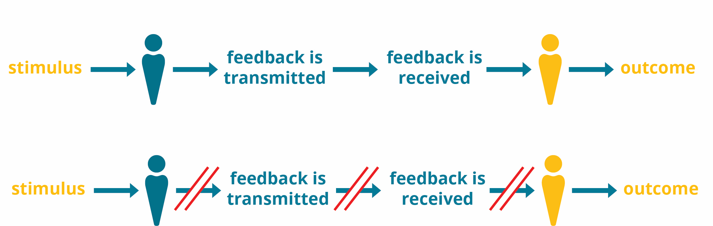

## The Carpentries Feedback Ethos

Feedback is more than information. As stated in our [Core Values](https://carpentries.org/values/), “_we value a growth mindset in all that we do and strive for continuous improvement, evolving ourselves and our methodologies, being responsive, curious, receptive to feedback, and eager to learn._” Feedback flows around The Carpentries community in a myriad of ways during our in-person events (workshops, instructor training, CarpentryCon/CarpentryConnect), and through various synchronous and asynchronous communication channels. In this section you will understand how feedback mechanisms currently work across all initiatives in The Carpentries, and how Feedback Facilitators will support the community by closing the feedback loop. 

## Feedback from the Carpentries Core Team & Governance to the Community

The Carpentries [Core Team](https://carpentries.org/team/) and [Governance](https://static.carpentries.org/governance/) provides the community with feedback pertaining to the overall strategic direction of the Carpentries organisation. This feedback is often in the form of an announcement on the Carpentries [blog](https://carpentries.org/blog/), or update in the Carpentries [handbook](https://docs.carpentries.org/). Here you will learn more about the different types of feedback The Carpentries Core Team and Governance gives and receives.

### Between Community and  Core Team

The Carpentries [Core Team](https://carpentries.org/team/) provides feedback to the broader community about:
- [Quarterly Projects](https://carpentries.org/core-team-projects/#top-of-page): Core Team quarterly projects were introduced in the first quarter of 2019. The Core Team shares the outcomes of these quarterly projects at the end of each quarter and sometimes issues a call to action for the community to get involved. Many quarterly projects are in response to community needs.
- [Job Opportunities](https://carpentries.org/team/): The Carpentries shares job openings when they are available, and invites community members to apply for those roles, and share those opportunities around their networks.
- Community Leadership Opportunities: Each year the Core Team invites community members to apply for leadership positions, including, but not limited to the following roles: Trainer, Instructor, Executive Council Member, Code of Conduct Committee Member, Maintainer, Instructor Development Committee Member, and now, community facilitator. 
- [Revisions in Policy and/or New Policies](https://docs.carpentries.org/topic_folders/policies/index.html): When revisions are made to policies under The Carpentries, these changes are communicated to the community, and often the Core Team provides an opportunity for the community to give feedback. 
- Workflows and Operations: There are several workflows in place around workshop operations, community development, and instructor training. The Core Team communicates new and/or improved workflows to the community and often asks for feedback on those improvements.
- Other: The Core Team provides feedback in other ways, including announcements for new funding and partnerships.

> ## CHALLENGE 
>
>Select one of the posts below from the Carpentries [blog](https://static.carpentries.org/blog/). Identify the ways in which the Core Team solicited feedback from the community. Discuss with a partner.
>
> - [2020-2021 IDC Leadership Call for Applications](https://carpentries.org/blog/2020/08/IDC-leadership-call-for-applicants/)
> - [Carpentries Trainer Training Fall 2020](https://carpentries.org/blog/2020/07/trainer-training-fall-2020/)
> - [Carpentries Values Project - An Update and Call for Input](https://carpentries.org/blog/2019/09/carpentries-values-update-and-question-three/)
> - [Updates to Privacy Policy](https://carpentries.org/blog/2018/05/privacy-policy/)
{: .challenge}

### From Governance to Community

The Carpentries [Governance](https://static.carpentries.org/governance/) provides feedback to the broader community about:
- [Code of Conduct Transparency Reports](https://github.com/carpentries/executive-council-info/tree/master/code-of-conduct-transparency-reports): The Carpentries Executive Council issues public releases describing incidents reported to the Code of Conduct Committee.
- [Governing Document Updates](https://docs.carpentries.org/topic_folders/governance/index.html): The official governing documents of the Carpentries includes the Bylaws and Lesson Program Policy. Updates and revisions to these governing documents are often shared with the community for input and comments.  

> ## CHALLENGE 
>
>Select one of the posts below from the Carpentries [blog](https://static.carpentries.org/blog/). Identify the ways in which the Executive Council solicited feedback from the community. Discuss with a partner.
>
> - [A Call to Action: Nominate Yourself for the Executive Council Today](https://carpentries.org/blog/2019/11/executive-council-nominations/)
> - [The Carpentries Vision Statement](https://carpentries.org/blog/2019/11/executive-council-nominations/)
> - [Request for Comment on Carpentries Mission and Vision](https://carpentries.org/blog/2018/08/mission-vision-rfc/)
> - [Standing with our Code of Conduct](https://carpentries.org/blog/2019/04/datacamp-response/)
{: .challenge}

### From Community to Governance and Core Team

There are several ways community members formally provide feedback to The Carpentries Governance and Core Team. These include:
- [Assessment](https://github.com/carpentries/assessment) (Formal/Invited Feedback): Assessment projects are led by The Carpentries Instructor Training Team. Assessment at the Carpentries includes learner 9pre- and post-workshop surveys, long-term surveys), and programmatic (instructor training surveys, anonymized data from instructor training applications, instructor check-out rate, etc.) The Carpentries uses the feedback we receive from assessment surveys to inform improvements in workshop operations and the instructor training curriculum. When community members complete Carpentries surveys it provides us with a formal feedback mechanism.
- [Community Discussions](https://docs.carpentries.org/topic_folders/instructor_development/community_discussions.html) (Social/Shared Feedback): Community Discussion are online meetings where instructors share experiences from teaching and obtain information while preparing to teach. The Carpentries Community Discussions are designed for everyone in The Carpentries community interested in learning, educating and advocating for teaching foundational coding and data science skills globally. Discussion topics range anywhere from teaching workshops and developing curricula to building local communities and assessing the impact of our workshops globally. Community members share feedback and experience during community discussions verbally, and in writing via the discussion host  and participant surveys.
- [CoC Incident Report Form (Formal/Invited Feedback)](https://docs.carpentries.org/topic_folders/policies/index_coc.html): If a community member believes someone violated the [Code of Conduct](https://docs.carpentries.org/topic_folders/policies/code-of-conduct.html) during a Carpentries event or in a Carpentries online space, we ask that they report it by completing the [Code of Conduct Incident Report Form](https://goo.gl/forms/KoUfO53Za3apOuOK2). The form may be completed anonymously, or an individual may include their contact information. This is one of the key ways the community provides feedback to the Carpentries Governance.
- Requests for Comments/Feedback (Formal/Invited Feedback): The Carpentries utilises the Request for Comments (RFC) framework to help shape our programs and governance. We will explore this in the following case study.
- Carpentries Communication Pathways: Feedback is often shared between The Carpentries Core Team and the Community when mentioning @thecarpentries, @datacarpentry, @swcarpentry, or @libcarpentry on Twitter, or sending an email to [team@carpentries.org](mailto:team@carpentries.org) or [community@carpentries.org](mailto:community@carpentries.org). 

> ## CASE STUDY 
>
> **REQUEST FOR COMMENT ON THE CARPENTRIES BYLAWS:** 
>
>Think: Read the short blog post linked below. Using what you know about what optimally presented feedback looks like, whether the information in this blog post was presented in a format that is easy for community members to take action on (e.g. Specific, Objective, Timely, Actionable).
>
> [Help Shape the Governance of Our Community](https://carpentries.org/blog/2018/08/bylaws-rfc/)
{: .callout}

The distinction between this kind of formal feedback and the feedback you will receive and collate as Feedback Facilitators will be covered in this training.

### Feedback from Community to Community

Community members provide social/shared feedback by sharing their ideas and experiences in all of our communications channels and repositories, and during workshops, instructor training, and other community meetings. As Feedback Facilitators, you will be tasked with focusing on the informal communication pathways that exist in the Carpentries, and collating community feedback you find in our communications channels.

## Identifying the Feedback Distortions

When is the right time to “act” when we receive feedback as a community? For instance, if a Carpentries Community member provides feedback regarding an issue they are having with one of our tools, what is the process for a) collecting that information, b) sharing that information with the appropriate persons, c) developing a timeline for resolving the issue, and d) communicating the resolution back to the individual and broader community where applicable? As Feedback Facilitators you will close the feedback loop.

## How Feedback Facilitators will Close the Feedback Loop

Now that you understand how feedback flows and where the gaps are, we hope you understand why your role as a Feedback Facilitator is so important. To prime you for a later section on [closing the feedback loop](../02-5-closing-the-feedback-loop/), please complete the following exercise.

> ## CHALLENGE  
>
> As Feedback Facilitators part of your role will be to acknowledge responses we receive when asking for the community to engage with us on a particular topic. In groups of 3, create a flow chart of what this process could potentially look like. In your flow chart, be sure to include the following steps:
>
> - Acknowledge that feedback has been received
> - Timeline for hearing back about next steps
> - Resolution and rationale
{: .challenge}


