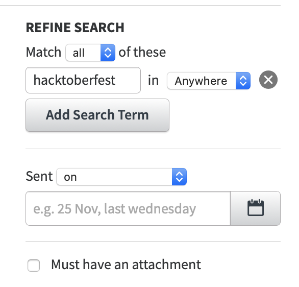
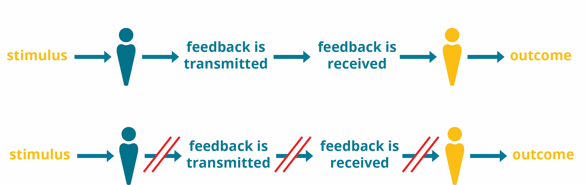

So far, we have learnt that feedback is an innate component of human experiences, and the relationship between the two can be likened to one between shadows and objects - even when you cannot see it, you know it is there. Creating formal processes for channeling feedback back to the designers of community experiences is an important step in sustaining an existing community and creating avenues for it to grow and thrive.

Feedback collection is the process by which, through observation, invitation or conversation, information about people's experiences around an initiative is recorded. Here are a few reasons why feedback is collected:

- For goodwill
  
  Whether collected or not, feedback exists in some form - in people’s minds or in whisper networks. Collecting feedback opens up a channel to listen to people that participate in or are influenced and affected by the initiatives we run.

- For posterity
  
  Collecting feedback makes it possible to provide meaningful context for what was done and its outcome. This is important information when handing over an initiative to others, or marking its end.

- For process auditing 
  
  For many initiatives, intent and outcome do not always align, and collecting feedback makes it possible to see where the feedback distortions are.
  
- Capacity building
  
  Once feedback is collected and used to audit processes and initiatives, it can help 
    - inform proposals for future work, and 
    - make a case for the need for more resources i.e. personnel, time, funds, etc 
    
- Community sustainability

  The overall outcome of seeking goodwill, documenting progress based on community input and amending an initiative’s roadmap based on changes can be continued collaboration on shared goals and transparency which, over time, constitute community sustainability 
  
> ## DISCUSSION 
>
> Apart from the five reasons for collecting feedback that are stated above, share additional reasons why feedback is sought from communities that you are part of.
{: .callout}

## Scouting for feedback

### TL;DR

This is the workflow to employ in collecting feedback: 

1. identify topic you would like to collect feedback on
2. depending on the time commitment, determine which platform you are able to focus on 
3. communicate with other Feedback Facilitators to let them know you are about to start scouting for feedback. To do so, go to [this spreadsheet](https://docs.google.com/spreadsheets/d/1RcPqtY3D-PQAnGhGSLvYmjWna7qxNTvqt_zKGTgJ04I/edit?usp=sharing) and
    1. check that previous logs do not cover the same scope of work you want to focus on
    2. fill the spreadsheet with your date/time log detailing the platform you will focus on

### Conversational Communications Channels

As the name suggests, conversational communications channels allow room for real time, asynchronous deliberation around topics, updates and questions shared with our community. 

#### Facebook

[Our Facebook group](https://www.facebook.com/carpentries) is therefore a great way for them to receive communication and announcements on broader topics that affect a majority of the people in our community. 
Here is what a comprehensive approach to collecting feedback on Facebook looks like:
- if you have a FaceBook account and are not a member of the group, start by joining the group
- search for keywords in the [Facebook group](https://www.facebook.com/carpentries) and see if any outstanding questions exist under announcements shared by The Carpentries
- search for 'The Carpentries' + key terms in the platform-wide search tool to see what context and conversations exist,
- note the URL of the post containing feedback, and 
- create a GitHub issue with a short summary of the feedback. (Organising Feedback section provides a detailed guide for how to do this)

> ## TODO 
>
>in one of your monthly check-ins as feedback facilitators, either in month 3 or 4, take 20-30 minutes to 
> - co-create a rubric based on your experiences to help future feedback facilitators determine if the feedback they come by suits the scope of work,
> - advice on where to record this feedback when it does or doesn't fit the scope and 
> - add a set of screen grabs or gif showing these steps
>
>You can carry out this exercise in your collaborative Etherpad first, before opening a Pull Request in this repository
{: .callout}

#### Twitter

Our current Twitter strategy includes primary use of The Carpentries account, with an ongoing campaign to encourage Software Carpentry, Library Carpentry, and Data Carpentry followers to follow the main account.

Here is what a comprehensive approach to collecting feedback on Twitter looks like:
- remember that The Carpentries has Twitter presence on four accounts, so check for mentions and replies to key announcements in those channels
- determine what set of hashtags dedicated to a specific topic would be relevant to skim through in your search, for example, for any conversations around online workshops, #teachingonline, #onlineteaching and #onlinelearning are a good starting point
- make use of [Twitter's Advanced Search feature](https://twitter.com/search-advanced). Some conversations may span back 8 or 10 years, because Software Carpentry has been a lesson program since 1998, Data Carpentry was founded in 2015 and Library Carpentry in 2017 - so narrowing down the scope of your search to specific dates might help you keep track of how far you get in scouting for feedback each time
- note the URL of the tweet or tweet thread containing feedback, and 
- create a GitHub issue with a short summary of the feedback. (Organising Feedback section provides a detailed guide for how to do this)

#### LinkedIn

LinkedIn is primarily used for making professional connections, networking, and job opportunities. It is a place where we list [Carpentries Core Team](https://carpentries.org/team/) members, and cross-post relevant organisation announcements, particularly targeted at potential member organisations. We have an [instructors group](https://www.linkedin.com/groups/8279689/) and an [organisation page](https://www.linkedin.com/company/the-carpentries/about/).
Here is what a comprehensive approach to collecting feedback on LinkedIn looks like:
- if you are not a member of the Carpentries Instructors group, start by joining the group
- search for keywords in the LinkedIn instructors group or The Carpentries page on LinkedIn and see if any outstanding questions exist under announcements shared by The Carpentries. [Here is an official, detailed guide to using search on LinkedIn](https://www.linkedin.com/help/linkedin/answer/302/searching-on-linkedin?lang=en).
- search for 'The Carpentries' + key terms in the platform-wide search tool to see what context and conversations exist,
- note the URL of the post containing feedback, and 
- create a GitHub issue with a short summary of the feedback. (Organising Feedback section provides a detailed guide for how to do this)

#### Slack

[The Carpentries Slack](https://swcarpentry.slack.com/) is used to receive immediate feedback from community members. Channels are driven by community members (e.g. initiatives) and Core Team (e.g. project related). Due to the primarily community driven approach to Slack, some channels fall idle while others remain active. 
Here is what a comprehensive approach to collecting feedback on Slack looks like:

- If you are not a member yet, [click here to join The Carpentries Slack channel](https://swc-slack-invite.herokuapp.com/). 
- The Slack Team has put together [a comprehensive guide to comprehensive search on the platform](https://slack.com/intl/en-ee/blog/productivity/shrinking-the-haystack-how-to-narrow-search-results-in-slack), please have a read.
- search for keywords in Slack, following recommended practices in the article above, and see if any outstanding questions and ideas exist around key search terms
- check with community members who posted relevant information whether it is ok to copy their feedback over to GitHub issues verbatim. 
- Unless granted consent, always paraphrase and summarise the feedback, leaving out any identifying and sensitive information. When in doubt, check with the Director of Community Development and Engagement, Serah Rono. 
- create a GitHub issue with a short summary of the feedback. (Organising Feedback section provides a detailed guide for how to do this)

#### Google groups

Many of The Carpentries Google Groups are now email lists on [TopicBox](https://carpentries.topicbox.com/latest). 

Here is what a comprehensive approach to collecting feedback on our old Google Groups looks like:
- check that you have permissions to read historical content in our google Groups. If need be, request for permission from the Director of Community Development and Engagement, Serah Rono. 
- search for keywords in the Google Group, using filters to refine your search and see if any outstanding questions and ideas exist around key search terms
- check with community members who posted relevant information whether it is ok to copy their feedback over to GitHub issues verbatim. 
- Unless granted consent, always paraphrase and summarise the feedback, leaving out any identifying and sensitive information. When in doubt, [check with the Director of Community Development and Engagement, Serah Rono](mailto:serah@carpentries.org). 
- create a GitHub issue with a short summary of the feedback. (Organising Feedback section provides a detailed guide for how to do this)

#### TopicBox

[Topicbox](https://carpentries.topicbox.com/latest) is used for announcements and richer discussions which, while possible, would be too crowded and unsuited for Slack. It is also a preferred communication channel for members seeking to limit the number of channels they follow.

[Discuss](https://carpentries.topicbox.com/groups/discuss) is where The Carpentries community comes to amplify their own opportunities, suggestions, and observations. The popularity of discuss is somewhat due to its ease of use as a general all purpose communications channel. 
Here is what a comprehensive approach to collecting feedback on TopicBox looks like:
- Check that you have access to relevant program and subcommunity lists for the topic you are charged with. If not, email [community@carpentries.org](mailto:community@carpentries.org) and one of the Carpentries Community Development team members will give you access. This blog post gives a good breakdown of The Carpentries mailing lists on TopicBox
- Search for keywords related to the subject in question
- Use TopicBox filters on the right of your screen to refine your search

_screengrab above shows filters available to a user on The Carpentries' TopicBox_

#### GitHub

[GitHub](https://github.com/) is a software development platform that The Carpentries employs to host our lessons, communicate about projects, publish our website, and collaborate openly with the community. Each lesson program within The Carpentries has several lessons that are maintained by a group of volunteers we call Maintainers. [Issues](https://help.github.com/en/articles/about-issues) and [pull requests](https://help.github.com/en/articles/about-pull-requests) are welcome from community members on all of our lessons, and our Instructor Training curriculum.

The Carpentries uses GitHub issues to collate feedback that facilitate changes to policy, committee structure, and other functions of the organisation. Comments remain open for a period of time, and once feedback is collected and incorporated, we close the issue.

As many of our projects involve community members, we recommend the use of [GitHub project boards](https://help.github.com/en/articles/about-project-boards) to collaborate openly about projects with the community. One example of a project is the [Code of Conduct Guidelines Project](https://github.com/carpentries/coc-guidelines-taskforce/projects) and [The Carpentries Strategic Plan](https://github.com/carpentries/strategic-plan/projects/1) project. We will cover GitHub projects in more depth a bit later in this resource.

Here is what a comprehensive approach to collecting feedback on GitHub looks like: 
- Determine which repositories in The Carpentries organisation are relevant for the subject you are looking into
- Use GitHub’s Advanced Search feature to get the information you need. We recommend following [this detailed guide](https://docs.github.com/en/github/searching-for-information-on-github/searching-on-github) to Advanced Search on GitHub.

#### Gitter

In the past, Gitter has mainly been used by the Library Carpentry community for sprints. The #libraries Slack channel is [now primarily promoted](https://swcarpentry.slack.com/archives/CFFM1KQJH/p1550467370007400) as the preferred everyday communication platform for the Libraries community.
There is also an inactive Data Carpentry ([https://gitter.im/data-carpentry/Lobby](https://gitter.im/data-carpentry/Lobby)) and Software Carpentry ([https://gitter.im/swcarpentry/public](https://gitter.im/swcarpentry/public)) Gitter. However, plenty of historical data exists in Gitter, and may benefit our search for community feedback and ideas from past years. 
To search for information on Gitter, [please follow this detailed guide by GitLab](https://gitlab.com/gitlab-org/gitter/webapp/blob/master/docs/messages.md#searching-messages).

> ## CHALLENGE QUESTION: 
>
>In pairs, pick a social platform and let others know what platform you have selected for the exercise. If your platform of choice has been selected by others, pick another. 
>
> Spend the next 10 minutes collecting feedback from Carpentries community members on the use of Zoom breakout rooms in online workshops or discussions. Remember to take notes in the Etherpad.
{: .challenge}

### Broadcast Communications Channels

Broadcast channels are, as the name suggests, uni-directional in nature and primarily used to pass along announcements, opportunities, requests for comment and other relevant calls to action.

#### Website and Blog

[The Carpentries blog posts](https://carpentries.org/blog/) allow community and Core Team members to share announcements with the broader community. As with lessons, the [Creative Commons Attribution (CC-BY)](https://creativecommons.org/licenses/by/4.0/) license extends to all website content.
To search for feedback on all blogs associated with The Carpentries
- Use [blog tags](https://carpentries.org/posts-by-tags/) as a starting point, taking note of the ones that are relevant to the subject you are covering. [Here is The Carpentries guide](https://docs.carpentries.org/topic_folders/communications/guides/select-blog-tags.html) and breakdown for blog tags.

#### YouTube

[YouTube](https://www.youtube.com/channel/UCBOUNBBZxc4DML3F89cEvGA/) is used in The Carpentries primarily as an archival tool to share videos from community events like [CarpentryCon 2018](https://2018.carpentrycon.org/), [CarpentryCon @ Home](https://2020.carpentrycon.org/), as well as recorded themed discussions that take place more regularly. Comments are disabled on The Carpentries YouTube channel, and we recommend searching for video URLs on the other platforms, using guides specific to each platform, to find any feedback relevant to published videos.

#### Newsletter
Our current Carpentry Clippings strategy is like so: The Carpentries Communications Manager (Omar Khan) works to solicit and organise contributions from community members - making sure Core Team members submit updates, and then writing, formatting, and publishing content from them. Some content curation is also involved i.e. for "Tweet of the Week" and "Toolshed (Posts from our Past)" sections.
To find feedback from community members relevant to The Carpentries newsletter, use the search term ‘Carpentry Clippings’ on the different channels.

> ## DISCUSSION 
>
> What are some of the ways to improve the way feedback is shared by community membersfor content published on broadcast channels such as the ones listed above?
{: .callout}

## Soliciting for Feedback

Earlier, we discussed how constructive feedback is often SPECIFIC, OBJECTIVE, TIMELY and ACTIONABLE. If you have decided to ask others for feedback, it can help to consider the following questions so that the responses   you receive will be as clear as possible:

### What is your goal in collecting the feedback?
 
This will help you to determine the question(s) that you want to ask and how to get to responses that are SPECIFIC.

E.g. If your goal is to determine whether learners attending a workshop were able to access and understand all of the course materials, then the questions that you ask would specifically pertain to how learners had accessed the materials and then interacted with them. 

### What factors may distort the feedback?

Asking this question will help you to obtain feedback that is more OBJECTIVE. E.g. asking for verbal feedback from learners at the end of a workshop may result in learners only sharing positive feedback out loud because they don’t feel comfortable sharing negative feedback in a group setting. Or it may be difficult to be present and listen to the feedback and write it down accurately at the same time so details may be missed - including who gave the feedback or precisely what it was about. Also, relying on one person to note down feedback may result in them recalling things that resonated most strongly with them and not be a fully accurate representation of what was shared.

### What is the optimal format for gathering the feedback?

This will determine whether you’re able to gather feedback that is ACTIONABLE. 

E.g. You might decide that gathering the feedback verbally at the end of a workshop would be too subjective and difficult to review later. You might conclude that an exit survey would be an optimal format as it will provide more structured answers that will allow you to answer specific questions about the technical set up, learning materials, and experiences of the learners so that you can improve future workshops. Asking learners to optionally leave their contact details would allow you to follow up later.

### When is the best time to ask for feedback?

Asking yourself this question may reveal conflicting time pressures that your respondents might be facing or a deadline that is closer than you realised. This will enable you to ask for feedback in a TIMELY manner.

E.g. asking for feedback about a workshop experience is best asked at the end of the workshop itself while the learners are still engaged, rather than several days or weeks afterwards when it may not be a priority for them. 

### Additional considerations

There are some additional things to consider when putting together communications that request feedback:

#### Open vs closed questions 

- A closed question is one where there is only a limited answer possible e.g. “Did you enjoy the workshop?”. The most immediately accessible answers are simply yes, no or a more ambiguous response such as “mostly”. The way the question has been phrased did not explicitly invite more detailed feedback.
- A more open way of asking the question might be: “Can you describe something that you enjoyed about the workshop and something that you would like us to improve?”. When formulating an open question, be sure that it elicits a more descriptive response beyond just “yes” or “no”.

#### Making use of feedback clear

To avoid any misunderstandings about how and where feedback may be used, ideally this will be made clear on the first page of a survey, on an accompanying web page, or on the original request for feedback in a blog post or other medium.

### Responding to comments

If you have asked for feedback and received comments back e.g. on a post on social media, there are a few things to bear in mind before you respond.

> ## CHALLENGE 
>
>Let’s imagine that the following comment has been left on a blog post announcing an upcoming workshop series:
>
>_“I attended a Carpentries workshop last month and it was plagued by technical issues which stopped me from being able to hear half of the lesson. I hope this has been sorted out before this new series starts!”_
>
>What should you consider in responding to this feedback? 
{: .challenge}

> ## SOLUTION 
>
> - **Gratitude** - Start by thanking the person who left the feedback. They have taken the time to share their opinion. Your thanks should be sincere and ideally not use the same words each time you give thanks. 
>   - e.g. “Thanks for letting us know about your experience of the workshop.”
> - **Acknowledgement** - Acknowledge what is being said without passing judgment or questioning their experience. 
>   - e.g. “I’m sorry that you weren’t able to enjoy the workshop you attended as much as you had hoped.”
> - **Clarify meaning** - In order for you to further report the feedback, it will need to meet the S-O-T-A criteria that we discussed earlier (Specific, Objective, Timely, Actionable). Do you need to ask any clarifying questions to meet those criteria? 
>   - e.g. “Could you please let me know which workshop you attended so that I can follow up about this with the instructors? Were you able to pass this feedback on at the time either during the event itself or in the post-event survey?”
> - **Explain what action will be taken** - State what you are able to do about the feedback. Don’t over-commit or promise things that you may not be able to deliver. But do offer reassurance that the feedback has been received and will be directed to somewhere that it can be acted upon 
>   - e.g. “I’ll send this feedback to the core team who will be able to check the post-workshop reports and what action has been taken to resolve this issue. Someone from the team may be in touch directly, if that’s ok.”
> - **Should this conversation be continued on a private channel?** In some cases, it may be better to move a conversation to a private channel. This can include making space for others to comment on a thread, discussing details that may be sensitive in a safer environment (such as personal information, including the location of the person giving the feedback), and removing the social cues that may be inflaming the conversation as it plays out in public e.g. others upvoting or resharing the feedback elsewhere. Where possible, indicate this in your response so that others reading the thread can see that you continued to be responsive - just not in public. 
>   - E.g. “I’ll DM you to continue this conversation and get some more details about what happened. Thanks again for bringing this up.”
{: .solution}


