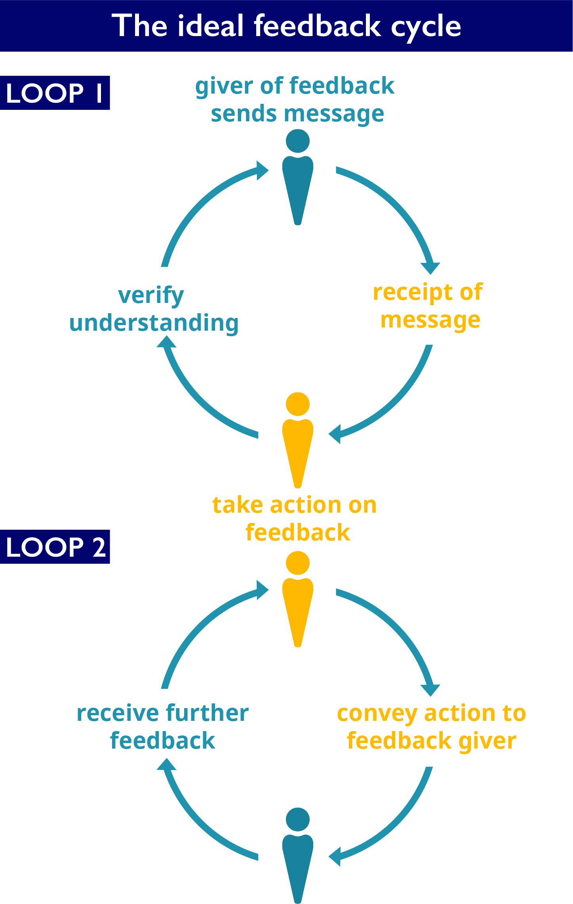

In the last exercise, you managed to 
- audit external workflows published in recent years and months by The Carpentries, 
- use the information shared as inspiration to help you fill the gaps and design the missing pieces of the process from your perspective (internal workflows in this case), 
- provide The Carpentries Core Team with feedback.

**Also recall that in an ideal feedback cycle,**

From the first loop below, Giver of feedback sends message ---> receipt of message ---> verify understanding 

From the second loop, Take action on feedback → convey action to feedback giver → receive further feedback

Up to this point in our feedback cycle, a community member does not yet know how The Carpentries intends to use any feedback they have shared with The Carpentries, if at all. For this reason, if they reads a community-wide request from us asking them to audit the process and give feedback, we anticipate that three things might happen:
- they may lean on your trust for The Carpentries, and give us feedback if, from your experience, we have acted on other feedback you shared or as goodwill
- they may ask how we intend to use the information they shared with The Carpentries as a followup to our request. If we respond satisfactorily, they may then decide to give feedback, or at least extend our request for feedback to others. 
- Given the time commitment, and lack of clarity around what happens next, they may bookmark this task for later, or take note and not act on it.

Closing the feedback loop is an important exercise that cultivates trust and encourages accountability in open communities. It is a set of steps that outlines what community members should expect once they share some form of feedback. These steps communicate very broadly that _‘you can trust us with your input, and we will in turn act on it in at least one of several ways’_. Below are a few examples of instances where closing the feedback loop helped to cultivate trust and opened up avenues for accountability in The Carpentries community:
- calls for comment, review and input as Carpentries Core Team iterated on the [Code of Conduct](https://docs.carpentries.org/topic_folders/policies/code-of-conduct.html) we currently use,
- calls for input as we worked to articulate our [Core Values](https://carpentries.org/values/) in 2019,
- incorporation of community ideas as we designed engaging community events like [CarpentryCon @ Home](https://2020.carpentrycon.org/) and
- publishing of community advice and adoption of some ideas as we developed an official set of [recommendations for running online workshops](https://carpentries.org/online-workshop-recommendations/) in Q2 2020
- Our hiring process in The Carpentries includes an 'interviews by community members' component where their feedback helps to inform who is hired as part of The Carpentries Core Team for specific roles.

> ## GROUP DISCUSSION
>
> Working in pairs, and using any two case studies listed in the [External Workflows section](../02-4-organising-carpentries-feedback/#external-workflows), identify some of the action points that The Carpentries shared that helped to cultivate trust and close the feedback loop. What other action points would have been good to communicate about?
{: .discussion}


